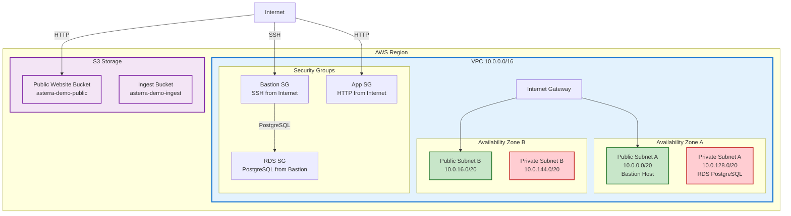

# AWS Infrastructure Architecture

## Architecture Overview



## Connection Flow

- **Internet → HTTP (80) → S3 Public Bucket** (Static Website)
- **Internet → SSH (22) → Bastion Host → PostgreSQL (5432) → RDS**
- **Internet → HTTP (80) → App Security Group → Public Subnets**

## Security Features

✅ **VPC Isolation** - All resources within private VPC  
✅ **Subnet Segmentation** - Public/Private separation  
✅ **No Direct Internet** - Private subnets isolated  
✅ **Multi-AZ** - High availability across AZs  
✅ **Security Groups** - Least privilege access control  
✅ **S3 Policies** - Proper public/private configuration  
✅ **Database Security** - RDS only accessible through Bastion  
✅ **Public Access Controls** - Account and bucket-level blocking  

## Terraform Outputs

```
vpc_id = "vpc-02669bf649c7a5f00"
public_subnet_ids = ["subnet-0024f23136bdc2c72", "subnet-0a5f48a27ec6d4d39"]
private_subnet_ids = ["subnet-0f723ef5946440ea3", "subnet-0fd2a85a1217488f1"]
app_public_sg_id = "sg-0816427004a3aa484"
rds_sg_id = "sg-084f5a85a2a05e7ff"
s3_ingest_bucket = "asterra-demo-ingest"
s3_public_bucket = "asterra-demo-public"
s3_public_website_endpoint = "asterra-demo-public.s3-website.eu-central-1.amazonaws.com"
``` 