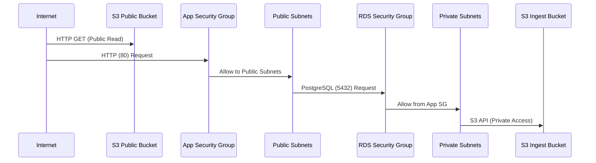

# AWS Infrastructure - Detailed Architecture

## Current Infrastructure Overview

Based on the Terraform configuration we implemented, here's the detailed architecture:

```mermaid
graph TB
    %% Internet Layer
    Internet[🌐 Internet]
    
    %% AWS Region Container
    subgraph AWS["🏢 AWS eu-central-1 Region"]
        
        %% VPC Container
        subgraph VPC["🔷 VPC: asterra-demo-vpc<br/>CIDR: 10.0.0.0/16"]
            
            %% Availability Zone A
            subgraph AZA["📍 Availability Zone: eu-central-1a"]
                PublicA["🌍 Public Subnet A<br/>10.0.0.0/20<br/>Auto-assign Public IP: ✅"]
                PrivateA["🔒 Private Subnet A<br/>10.0.128.0/20<br/>Auto-assign Public IP: ❌"]
            end
            
            %% Availability Zone B
            subgraph AZB["📍 Availability Zone: eu-central-1b"]
                PublicB["🌍 Public Subnet B<br/>10.0.16.0/20<br/>Auto-assign Public IP: ✅"]
                PrivateB["🔒 Private Subnet B<br/>10.0.144.0/20<br/>Auto-assign Public IP: ❌"]
            end
            
            %% Network Components
            IGW["🌐 Internet Gateway<br/>asterra-demo-igw"]
            
            %% Route Tables
            PublicRT["🗺️ Public Route Table<br/>• 0.0.0.0/0 → IGW<br/>• Associated with Public Subnets"]
            PrivateRT["🗺️ Private Route Table<br/>• No Internet Route<br/>• Associated with Private Subnets"]
            
            %% Security Groups
            AppSG["🛡️ App Public Security Group<br/>• Inbound: HTTP (80) from 0.0.0.0/0<br/>• Outbound: All traffic to 0.0.0.0/0<br/>• Name: asterra-demo-app-public-sg"]
            
            RDSSG["🛡️ RDS Security Group<br/>• Inbound: PostgreSQL (5432) from App SG<br/>• Outbound: All traffic to 0.0.0.0/0<br/>• Name: asterra-demo-rds-sg"]
            
            %% Route Table Associations
            PublicRT -.->|Associated| PublicA
            PublicRT -.->|Associated| PublicB
            PrivateRT -.->|Associated| PrivateA
            PrivateRT -.->|Associated| PrivateB
        end
        
        %% S3 Storage (Global Service)
        subgraph S3["📦 S3 Storage (Global)"]
            PublicS3["🌐 Public Website Bucket<br/>Name: asterra-demo-public<br/>• Static Website Hosting ✅<br/>• Public Read Policy ✅<br/>• Website Endpoint:<br/>asterra-demo-public.s3-website.eu-central-1.amazonaws.com"]
            
            IngestS3["🔒 Ingest Bucket<br/>Name: asterra-demo-ingest<br/>• Private Access Only ✅<br/>• Block Public Access ✅<br/>• Force Destroy ✅"]
        end
        
        %% S3 Access Controls
        subgraph S3Controls["🔐 S3 Access Controls"]
            AccountBlock["🏢 Account Public Access Block<br/>• Block Public ACLs: ✅<br/>• Ignore Public ACLs: ✅<br/>• Block Public Policy: ❌<br/>• Restrict Public Buckets: ❌"]
            
            PublicBucketBlock["🌐 Public Bucket Access Block<br/>• Block Public ACLs: ❌<br/>• Ignore Public ACLs: ❌<br/>• Block Public Policy: ❌<br/>• Restrict Public Buckets: ❌"]
        end
    end
    
    %% External Connections
    Internet -->|HTTP (80)| PublicS3
    Internet -->|HTTP (80)| AppSG
    
    %% Internal Connections
    IGW --> PublicRT
    
    %% Security Group Associations
    AppSG -.->|Protects| PublicA
    AppSG -.->|Protects| PublicB
    RDSSG -.->|Protects| PrivateA
    RDSSG -.->|Protects| PrivateB
    
    %% S3 Policy Dependencies
    AccountBlock -.->|Relaxes| PublicS3
    PublicBucketBlock -.->|Allows| PublicS3
    
    %% Styling
    classDef vpcStyle fill:#e3f2fd,stroke:#1976d2,stroke-width:3px
    classDef publicStyle fill:#c8e6c9,stroke:#2e7d32,stroke-width:2px
    classDef privateStyle fill:#ffcdd2,stroke:#c62828,stroke-width:2px
    classDef securityStyle fill:#fff8e1,stroke:#f57f17,stroke-width:2px
    classDef s3Style fill:#f3e5f5,stroke:#7b1fa2,stroke-width:2px
    classDef internetStyle fill:#e8f5e8,stroke:#388e3c,stroke-width:2px
    classDef azStyle fill:#fce4ec,stroke:#c2185b,stroke-width:2px
    
    class VPC vpcStyle
    class PublicA,PublicB publicStyle
    class PrivateA,PrivateB privateStyle
    class AppSG,RDSSG securityStyle
    class S3,PublicS3,IngestS3 s3Style
    class Internet,IGW internetStyle
    class AZA,AZB azStyle
```

## Infrastructure Details

### 🏗️ **Network Architecture**

| Component | CIDR Block | AZ | Public IP | Purpose |
|-----------|------------|----|-----------|---------|
| **Public Subnet A** | `10.0.0.0/20` | eu-central-1a | ✅ Auto-assign | Web servers, Load balancers |
| **Public Subnet B** | `10.0.16.0/20` | eu-central-1b | ✅ Auto-assign | Web servers, Load balancers |
| **Private Subnet A** | `10.0.128.0/20` | eu-central-1a | ❌ No | RDS, Application servers |
| **Private Subnet B** | `10.0.144.0/20` | eu-central-1b | ❌ No | RDS, Application servers |

### 🛡️ **Security Groups**

#### App Public Security Group (`asterra-demo-app-public-sg`)
- **Inbound Rules**:
  - HTTP (80) from `0.0.0.0/0` (Internet)
- **Outbound Rules**:
  - All traffic to `0.0.0.0/0`
- **Purpose**: Web application servers in public subnets

#### RDS Security Group (`asterra-demo-rds-sg`)
- **Inbound Rules**:
  - PostgreSQL (5432) from App Public Security Group
- **Outbound Rules**:
  - All traffic to `0.0.0.0/0`
- **Purpose**: Database access control

### 📦 **S3 Buckets**

#### Public Website Bucket (`asterra-demo-public`)
- **Configuration**:
  - Static website hosting enabled
  - Index document: `index.html`
  - Public read access policy
  - Website endpoint: `asterra-demo-public.s3-website.eu-central-1.amazonaws.com`
- **Access Control**:
  - Account-level public access block relaxed
  - Bucket-level public access allowed
  - Public read policy applied

#### Ingest Bucket (`asterra-demo-ingest`)
- **Configuration**:
  - Private access only
  - Full public access blocking
  - Force destroy enabled
- **Purpose**: Secure file storage for data ingestion

### 🔐 **Access Control Flow**



## Security Features

### ✅ **Network Security**
- **VPC Isolation**: All resources within private VPC
- **Subnet Segmentation**: Public/Private subnet separation
- **No Direct Internet**: Private subnets have no internet access
- **Multi-AZ**: High availability across availability zones

### ✅ **Access Control**
- **Security Groups**: Least privilege access control
- **S3 Policies**: Proper public/private bucket configuration
- **Database Security**: RDS only accessible through application security group
- **Public Access Controls**: Account and bucket-level S3 access blocking

### ✅ **High Availability**
- **Multi-AZ Deployment**: Resources across 2 availability zones
- **Route Table Redundancy**: Separate route tables for public/private
- **S3 Global**: S3 buckets accessible from any AZ

## Terraform Resources Created

### Network Resources
- 1 VPC with DNS support
- 2 Public subnets with auto-assign public IPs
- 2 Private subnets without internet access
- 1 Internet Gateway
- 2 Route Tables (Public/Private)
- 4 Route Table Associations

### Security Resources
- 2 Security Groups (App Public, RDS)
- S3 Account Public Access Block
- S3 Bucket Public Access Blocks
- S3 Bucket Policy

### Storage Resources
- 2 S3 Buckets (Public Website, Private Ingest)
- S3 Website Configuration

### Outputs
- VPC ID, Subnet IDs, Security Group IDs
- S3 Bucket names and website endpoint 